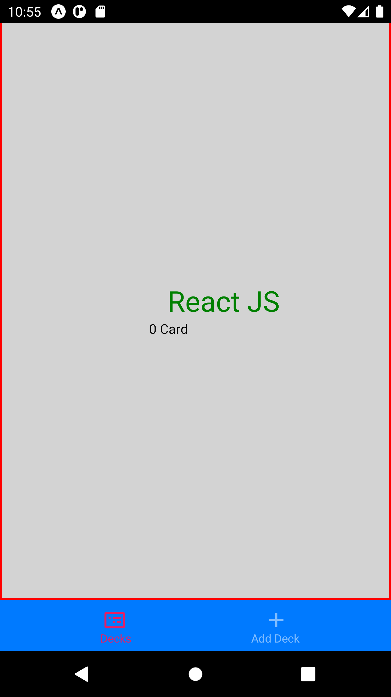

# Project Overview

For the UdaciCards project, I have built a mobile application (Android or iOS - or both) that allows users to study collections of flashcards. The app allowed users to create different categories of flashcards called "decks", add flashcards to those decks, then take quizzes on those decks.

## Targeted platform:

- Android

## How to install:

run the following command after checking it out locally.
- npm install
- expo start -a
- you need to download an expo client from playstore.
- open the expo app and scan the bar code to execute it on mobile device.

## Requirements:
- Specific Requirements
- Use create-react-native-app to build your project.
- Allow users to create a deck which can hold an unlimited number of cards.
- Allow users to add a card to a specific deck.
- The front of the card should display the question.
- The back of the card should display the answer.
- Users should be able to quiz themselves on a specific deck and receive a score once they're done.
- Users should receive a notification to remind themselves to study if they haven't already for that day.

## Screenshots:

# Create Deck
  

# Deck List
  

# Deck Detail

# Add Cards

# Quiz Screen

# Quiz Screen

# Quiz Completed

